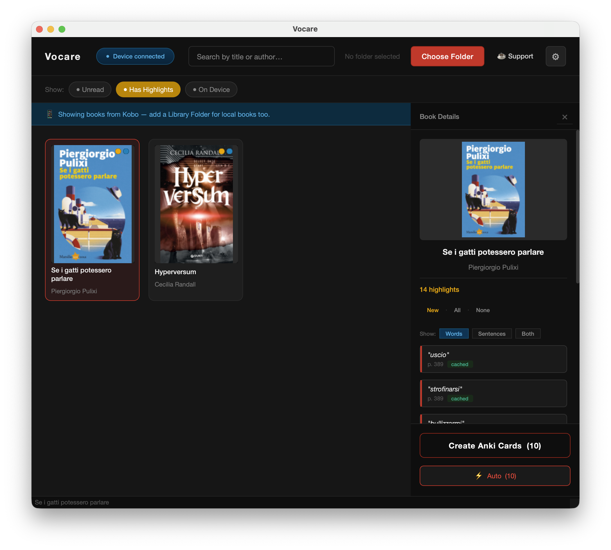
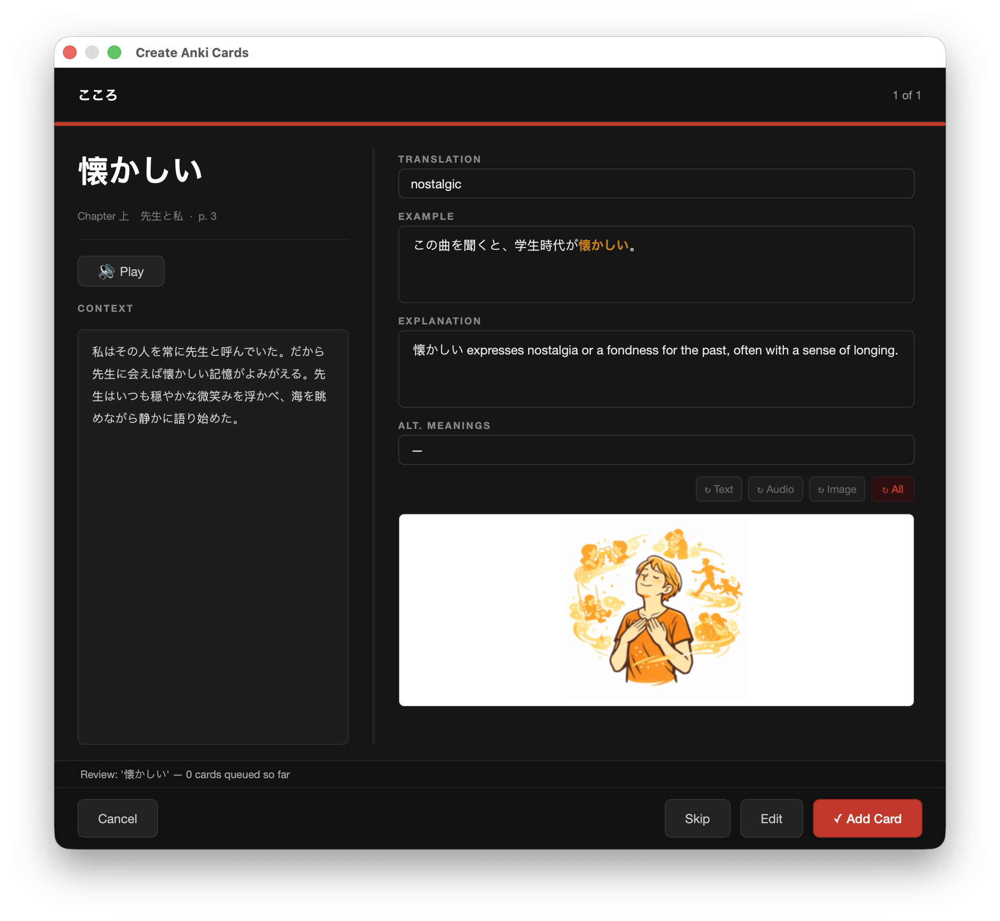
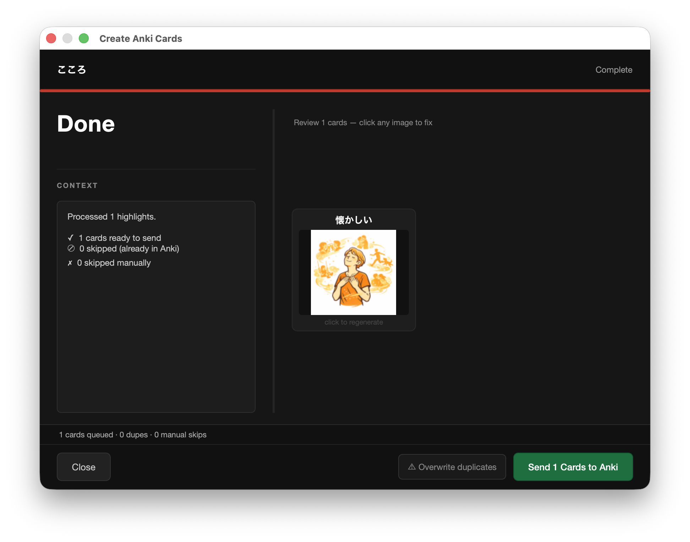
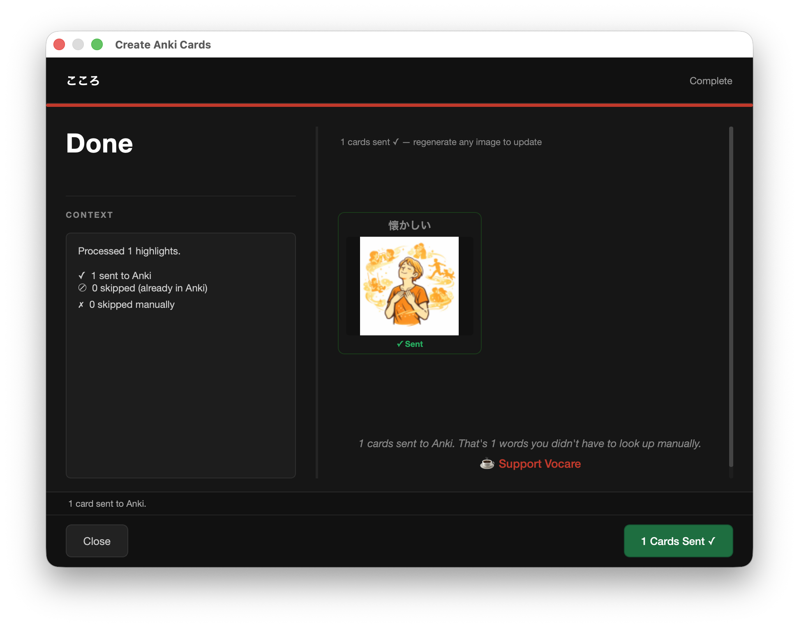

# Vocare

**Turn book highlights into Anki flashcards — automatically.**

Vocare reads the words you've highlighted while reading and builds a flashcard for each one: translation, audio, an illustration, and an example sentence in context. Cards land in your Anki deck. You read more, your vocabulary grows, the cards write themselves.

For language learners reading on Kobo, in Calibre, or wherever else.

---

> **Status: pre-release.** Vocare is approaching its first public beta. Expect rough edges — bug reports welcome. macOS only at v1.0.

---

## Screenshots

*Browse the books you've highlighted on your Kobo or in a local library folder. The right panel shows every word you marked, with cached entries flagged.*

*Review each card before saving. Translation, explanation, example sentence, audio, and an AI illustration — all generated automatically from one highlight.*

*Final review of every generated card. Click any image to regenerate before committing.*

*Done. The cards are in your Anki deck.*

---

## How it works

1. **You highlight words while reading** — on a Kobo (with KOReader or native Kobo), or in Calibre's viewer.
2. **Vocare scans** your library when you open the app, finds the books you've highlighted, and lists them.
3. **Pick a book.** Vocare lists every word you marked.
4. **Choose what to process** — all, just the new ones, or whatever subset.
5. **Vocare generates each card** in the background: Claude writes a translation + explanation + example, ElevenLabs (or local TTS) speaks the word, GPT Image / Ideogram / Flux draws an illustration matching the meaning. Sent to your Anki deck. Done.

You read. The cards build themselves.

---

## Supported sources

Vocare reads highlights from three formats. **Any device that produces one of these works** — Vocare doesn't care which model of e-reader you used, only what file format the highlights are stored in.

| Source format | What it is | Devices that produce it |
|---|---|---|
| **KOReader sidecar** | `.sdr/metadata.epub.lua` next to each book file | Any device running KOReader: Kobo, jailbroken Kindle, PocketBook, Boox, Onyx (USB-mountable into a Mac); also Android tablets and Linux desktops running KOReader, with their `.sdr` files copied over to the Mac |
| **Calibre annotations** | Highlights you marked in Calibre's desktop viewer (`metadata.db`) | Calibre on macOS, Windows, Linux |
| **Native Kobo SQLite** | `KoboReader.sqlite` on a Kobo device | Kobo devices used without KOReader |

**What about Kindle?** Native Amazon Kindle highlights aren't supported — they're tied to Amazon's DRM and the cloud sync API isn't open. **However:** if you've jailbroken your Kindle and read DRM-free epubs through KOReader, you have `.sdr` sidecars and Vocare reads them just fine. Same for PocketBook, Boox, and any other device running KOReader.

**What I've personally tested:** a Kobo Libra (KOReader + native) and Calibre 7 on macOS. The sidecar format is identical across KOReader devices, so other devices *should* work — community reports very welcome.

If a book has highlights in **multiple** sources (you read on Kobo *and* in Calibre), Vocare merges them and de-duplicates: the same word found across two readers in the same book collapses to one card, not two. KOReader is the source of truth on ties since its sidecar carries the richest metadata. The same word legitimately highlighted at *two different places* in a single source (e.g. once in chapter 3 and again in chapter 7 on the same Kobo) stays as two cards — those are real distinct user gestures with different contexts.

---

## Quick start

### 1. Install Anki + AnkiConnect

Vocare sends cards to Anki via the AnkiConnect plugin. If you don't have Anki yet:

- Download Anki: <https://apps.ankiweb.net/>
- Open Anki → Tools → Add-ons → Get Add-ons… → paste `2055492159` → Restart Anki.
- Anki must be **running** when Vocare sends cards. AnkiConnect listens on `localhost:8765` while Anki is open.

### 2. Get API keys for the AI providers

Vocare uses several AI services. You bring your own keys — Vocare never proxies through a server.

- **Anthropic Claude** (translations + explanations) — required. <https://console.anthropic.com/>
- **OpenAI** (image generation, default) — optional but recommended. <https://platform.openai.com/api-keys>
- **ElevenLabs** (high-quality voice audio) — optional. macOS Say or Google TTS work as free fallbacks. <https://elevenlabs.io/app/settings/api-keys>
- **Ideogram** / **FAL.AI Flux** — optional alternative image providers.

Estimated cost: a 100-card batch is roughly **$3–5** at OpenAI's GPT Image rates plus a fraction of a cent per Claude call. Audio via macOS Say is free.

### 3. Open Vocare

Drop `Vocare.app` into `/Applications` and double-click. Vocare is signed with an Apple Developer ID and notarized, so on first launch you'll see the standard *"This app was downloaded from the internet — are you sure you want to open it?"* dialog. Click **Open**. (No "right-click → Open" workaround needed — that's only required for unnotarized apps.)

Open **Settings** (gear icon, top-right) and paste your API keys. Choose your target language and your preferred providers.

### 4. Point Vocare at your books

Click **Choose Library Folder** in the empty grid. Pick:
- Your Calibre library folder (e.g. `~/Calibre Library/Books/`), or
- Any folder containing `.epub` files, or
- Plug in your Kobo and Vocare will detect it automatically.

Vocare scans, builds the grid, shows which books have highlights.

### 5. Make cards

Click a book that has highlights. The detail panel shows every word you marked. Pick the words you want to study (or click **All** / **New**). Hit **Create Anki Cards**. Vocare processes them — manually one-by-one, or in **Auto** mode where you walk away.

When the batch is done, the Done screen shows what got generated. Sent to Anki.

That's it.

---

## Configuration

All settings live in **Settings** (gear icon top-right). Saved at `~/.vocare/config.json`.

Most settings are self-explanatory — pick a target language, pick a provider per AI service, paste a key. A few worth highlighting:

### Anki note-type mapping

Tell Vocare which Anki fields receive which Vocare data (Word → Front, Translation → Back, Example → Examples, Audio → SoundField, Image → ImageField, etc.). One-time setup; saved in your config.

### Flux Safety Filter

The checkbox only toggles FAL.AI's *optional* post-generation safety check. FAL.AI's own platform content policy always applies and isn't bypassable from Vocare's side. Off is the default — vocabulary learning isn't typically flagged.

### Adaptive Intelligence (roadmap)

Future versions will let you rate generated images so Vocare learns your visual style. Not yet active in v1.0.

---

## Privacy

Vocare is **local-first**:

- Your books, your library, your highlights — never leave your machine.
- API calls go directly from your Mac to the AI providers you've configured (Anthropic / OpenAI / ElevenLabs / etc.). Vocare doesn't proxy or log anything to its own servers — there are no Vocare servers.
- Per-word translations land in `~/.vocare/result_cache.json` so re-processing a word is free.
- Crash logs go to `~/.vocare/logs/` only — never sent anywhere.

Full policy: see [`docs/PRIVACY.md`](docs/PRIVACY.md) in this repo.

---

## FAQ

### Vocare doesn't see my highlights — why?

Three possible sources, each with its own format:

- **KOReader** stores highlights in `<book>.sdr/metadata.epub.lua` files next to each `.epub`. Make sure those `.sdr` directories are present.
- **Calibre** stores highlights in its `metadata.db` SQLite. Vocare reads this directly. **If Calibre is open while Vocare scans, the database is locked** — you'll see a warning at the bottom of the window. Close Calibre and rescan.
- **Native Kobo** highlights live in `KoboReader.sqlite` on the device — Kobo must be plugged in.

### A bunch of my image generations failed — where did the error go?

Failed cards on the Done screen show an amber border + "⚠ Image failed" badge. Hover over the warning glyph to see the actual API error (insufficient balance, content policy, network, etc.). Click the failed tile to retry — the in-flight worker continues running and caches its output, so retries are cheap.

### How much does processing cost?

Roughly **$0.04 per card** at default OpenAI image rates, plus negligible Claude + ElevenLabs costs. A 100-card batch runs ~$3–5. Use macOS Say for free TTS to lower this further. A session cost counter is on the v2.0 roadmap.

### Does it work on Windows or Linux?

No. Vocare is macOS-only at v1.0. Windows is out of scope; Linux is community-driven if/when there's demand.

### Will you support iOS / Android?

iOS — yes, after macOS stabilises. The plan is a companion app that lets you photograph a physical book or comic page, tap the word you want, and produce the same kind of card. v3.0 target. Android — out of scope.

### Can I help test?

Yes — see [Helping out](#helping-out) below.

---

## Roadmap

**v1.x** — post-launch polish driven by community feedback. Bug fixes, performance work, UX details.

**v2.0** — Monolingual mode (define a word in its own language for advanced learners), OAuth ("sign in with your account" instead of pasting API keys), session cost counter.

**v3.0** — iOS companion app for physical books and comics.

Open an issue with `enhancement` to suggest something else; reactions on existing issues help me prioritise.

---

## Helping out

Vocare is free in v1.x. **One accepted contribution earns you v2.0 free for life when it ships — no questions asked.**

What counts as accepted:

- A reproducible bug report we triage and fix.
- A suggestion we ship or add to the public roadmap.
- A translation of a full UI section.
- Community work that drives meaningful traction (a blog post, tutorial, or Reddit/HN thread).

Open an issue on GitHub: <https://github.com/MestreShao-Studios/vocare/issues>. Contributors are credited in the **About** dialog.

---

## Reporting bugs

When something breaks, the most useful thing you can attach is the crash log:

- macOS: `~/.vocare/logs/crash_YYYYMMDD_HHMMSS.log`
- Open in any text editor; copy the whole file into the issue.

Issues: <https://github.com/MestreShao-Studios/vocare/issues>.

---

## A note

Vocare is the first product Mestre Shao Studios has shipped publicly. It surely has rough edges that haven't been found yet. If something in your reading workflow doesn't work or doesn't make sense, file an issue — those are the bugs and gaps that matter most.

— Mestre Shao Studios
